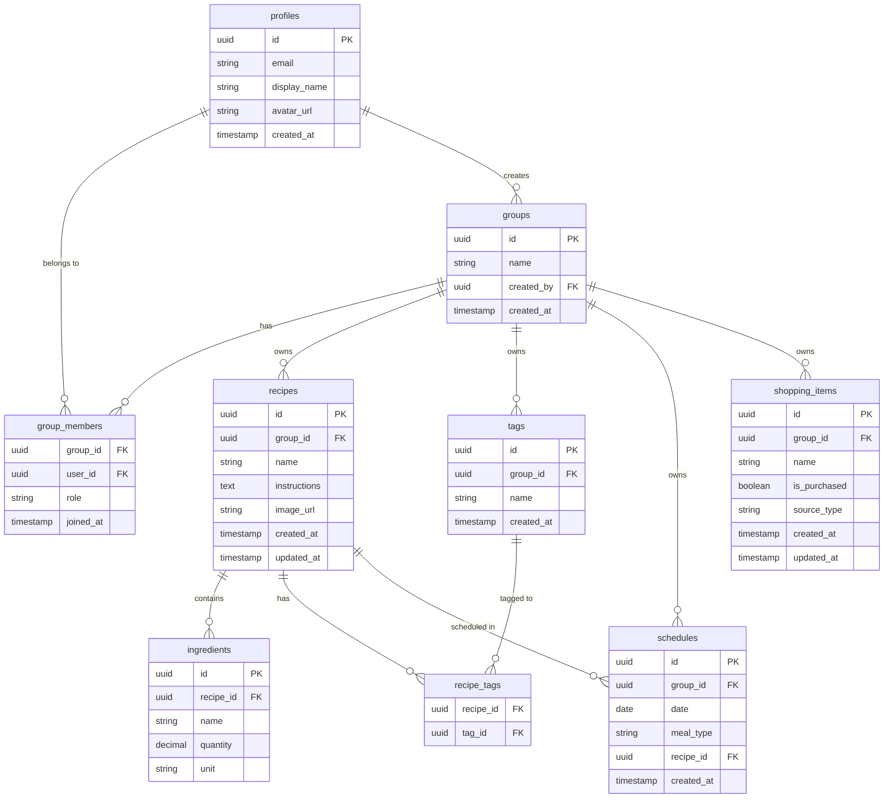

# データベースER図

## エンティティ関係図

## テーブル説明

### profiles
ユーザー情報を管理するテーブル。Supabase Authと連携。

### groups
グループ情報を管理するテーブル。献立やスケジュールを共有する単位。

### group_members
グループとユーザーの多対多の関係を管理。ロール（管理者/メンバー）も保持。

### recipes
献立情報を保存。名前、調理方法、画像URLなどを含む。

### ingredients
各献立に必要な材料を保存。数量と単位も管理。

### tags
献立に付与するタグ（主食、主菜など）を管理。グループごとにカスタムタグを作成可能。

### recipe_tags
献立とタグの多対多の関係を管理する中間テーブル。

### schedules
献立のスケジュール登録を管理。日付、食事タイプ（朝/昼/夕）、献立IDを保持。

### shopping_items
買い物リストの項目を管理。自動生成（スケジュールから）または手動追加を区別。

## データアクセス制御

Supabase RLS (Row Level Security) により、同じグループに所属するユーザーのみがデータにアクセス可能。

- `group_id` を基準にアクセス制御
- ユーザーは `group_members` テーブルを通じて所属グループを判定
- プライバシーとデータ分離を保証
